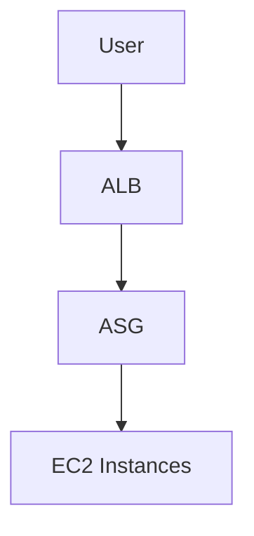

# 🟧 AWS Auto Scaling + Load Balancer Project

## 🎯 Goal
Deploy a scalable web application using:
- Launch Template  
- Auto Scaling Group  
- Application Load Balancer  

---

## 🧩 Architecture




## ✅ 1. Create Launch Template

- Go to EC2 → Launch Templates
- Name: bootcamp-template

- User Data:
- ```
  #!/bin/bash
yum update -y
yum install httpd -y
systemctl start httpd
echo "<h1>Auto Scaling App</h1>" > /var/www/html/index.html
```
