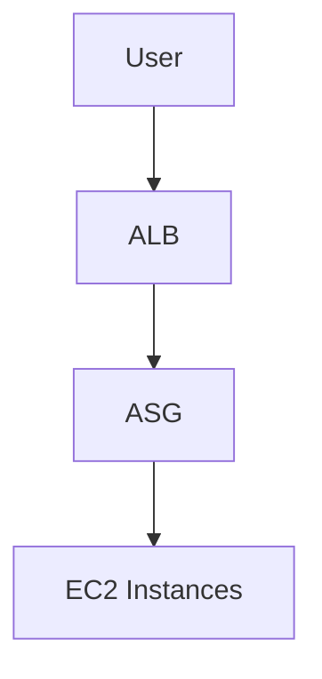

# 🟧 AWS Auto Scaling + Load Balancer Project

## 🎯 Goal
Deploy a scalable web application using:
- Launch Template  
- Auto Scaling Group  
- Application Load Balancer  

---

## 🧩 Architecture




## ✅ 1. Create Launch Template

- Go to EC2 → Launch Templates
- Name: bootcamp-template

- User Data:
```
#!/bin/bash
yum update -y
yum install httpd -y
systemctl start httpd
echo "<h1>Auto Scaling App</h1>" > /var/www/html/index.html
```

## ✅ 2. Create Auto Scaling Group

- Create ASG

- Choose launch template

- Network: default VPC

- Subnets: choose two AZs

- Desired capacity: 2

  Min: 1

  Max: 3


## ✅ 3. Create Load Balancer

- EC2 → Load Balancers → Create ALB

- Security Group: allow HTTP 80

- Target group → add ASG


## 🧹 Cleanup

- Delete:

  ASG

  Launch template

ALB
