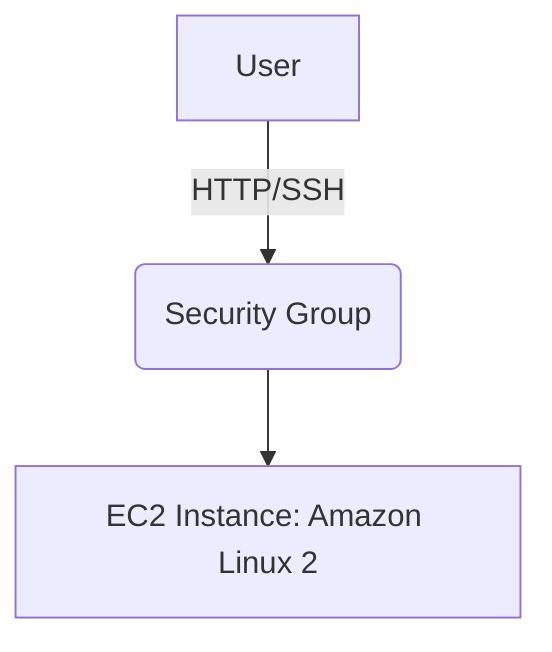

# 🟧 AWS EC2 Beginner Project — Host a Web Server

## 🎯 Goal
Launch an EC2 instance, secure it, and deploy a simple website.

---

## 🧩 Architecture



## ✅ 1. Create a Key Pair

- Go to EC2 → Key Pairs

- Create: bootcamp-key

- Download .pem file


## ✅ 2. Launch EC2 Instance

- EC2 → Launch Instance

- Name: web-server

- AMI: Amazon Linux 2

- Instance type: t2.micro (free tier)

- Key Pair: bootcamp-key

- Security Group:

     1. Allow SSH (22) from your IP

     2. Allow HTTP (80) from anywhere

## ✅ 3. Install Web Server

- SSH into EC2:

```
sudo yum update -y
sudo yum install httpd -y
sudo systemctl enable httpd
sudo systemctl start httpd
```

## ✅ 4. Add Website Content
```
echo "<h1>Welcome to your first web server!</h1>" | sudo tee /var/www/html/index.html
```

- Open your EC2 public IP in a browser.

## 🧹 Cleanup

- Terminate the EC2 instance.


---

# `aws/autoscaling-project/README.md`

```markdown
# 🟧 AWS Auto Scaling + Load Balancer Project

## 🎯 Goal
Deploy a scalable web application using:
- Launch Template  
- Auto Scaling Group  
- Application Load Balancer  

---

## 🧩 Architecture

```mermaid
graph TD
    User --> ALB
    ALB --> ASG
    ASG --> EC2[EC2 Instances]
