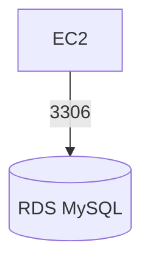

# 🟧 AWS RDS Project — Connect EC2 to a Database

## 🎯 Goal
Create an RDS MySQL instance and connect to it from EC2.

---

## 🧩 Architecture

```mermaid
graph TD
    EC2 -->|3306| RDS[(RDS MySQL)]
```
