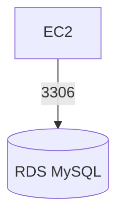

# 🟧 AWS RDS Project — Connect EC2 to a Database

## 🎯 Goal
Create an RDS MySQL instance and connect to it from EC2.

---

## 🧩 Architecture

## ✅ 1. Create RDS MySQL Instance

- Service: RDS → Databases → Create

- Engine: MySQL

- Instance: db.t3.micro

- Free tier: Enabled

- Storage: 20GB

- Public access: No

- Create new security group: rds-sg

## ✅ 2. Security Group Configuration

- EC2-SG ➝ RDS-SG

- RDS SG inbound rule:

| Type  | Port | Source             |
|-------|------|------------------|
| MySQL | 3306 | EC2 security group |

