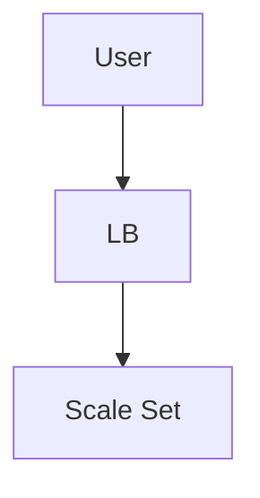

# 🔵 Azure VM Scale Set Project

## 🎯 Goal
Deploy a scalable web app using:
- VM Scale Sets  
- Azure Load Balancer  

---

## 🧩 Architecture



## Steps Summary

- Create Resource Group

- Create VM Scale Set

- Enable automatic scaling

- Configure load balancer

- Deploy app using cloud-init

## cloud-init.yaml Example
```
#cloud-config
package_upgrade: true
packages:
  - apache2
runcmd:
  - echo "<h1>Azure Scale Set App</h1>" > /var/www/html/index.html
  - systemctl restart apache2

```

## Cleanup
```
az group delete -n bootcamp-rg -y
```
