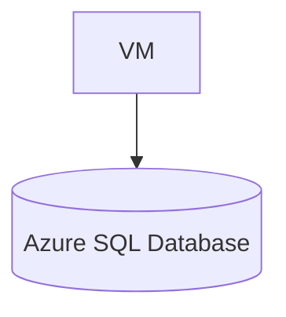

# 🔵 Azure SQL Database Project

## 🎯 Goal
Create an Azure Database for MySQL and connect from a VM.

---

## 🧩 Architecture



## Steps
### 1. Create Azure SQL

- Service: Azure Database for MySQL Flexible Server

- Location: eastus

- SKU: Burstable B1s

- Storage: 20GB

- Public access: Disabled

- VNet integration recommended

### 2. Connect from VM

- Install MySQL client:
```
sudo apt install mysql-client -y
```

### Connect:
```
mysql -h <server>.mysql.database.azure.com -u admin -p
```

## Cleanup

- Delete SQL server + VM.
