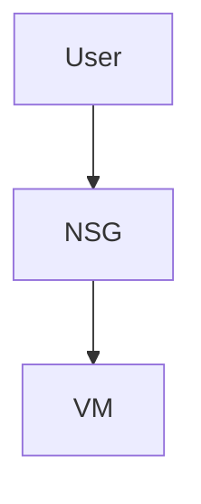

# 🔵 Azure VM Beginner Web Server Project

## 🎯 Goal
Deploy a Linux VM and host a web server.

---

## 🧩 Architecture



## ✅ 1. Create Resource Group
```
az group create --name bootcamp-rg --location eastus
```

## ✅ 2. Create VM

- Using portal:

    1. Ubuntu 22.04 LTS

    2. Size: B1s

    3. Authentication: SSH key

- Open ports in NSG:

   1. SSH 22

   2. HTTP 80
 
## ✅ 3. Install Web Server
```
sudo apt update -y
sudo apt install apache2 -y
sudo systemctl enable apache2
sudo systemctl start apache2
```

## 🧹 Cleanup

- Delete resource group:
```
az group delete -n bootcamp-rg -y
```
